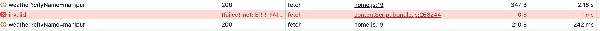

# Weather App

Weather App is a web application built with Node.js, Express, React, and MongoDB, designed to provide users with real-time weather information for any city. This is robust application using AWS Secrets Manager for secrets storage and MongoDB for caching purposes.

## Hosted on:

| **⚠️ Warning**                               | 
|------------------------------------------|
| The initial startup time for Render.com server is ~50 seconds so the first time you call, it may be a delayed response. The subsequent responses are quick.     |

https://weatherapp-48lu.onrender.com

## Features

- Allows users to search for weather information by city name.
- Displays temperature, description, and other weather details for the selected city.
- Caches weather data to improve performance and reduce API requests.
- Uses AWS Secrets Manager to stash the secrets which include the API key, AWS credentials and Mongo credentials.
- Responsive design for seamless usage on desktop and mobile devices.

## Tech Stack

- **Frontend**: React.js
- **Backend**: Node.js, Express
- **Database**: MongoDB (Caching)
- **API**: OpenWeather API
- **Secrets Manager**: AWS Secrets Manager
- **Deployment**: Render.com

## Screenshots

### Screenshot for the UI


## Latency difference between fetching from cache and fetching from the API


When fetching form the API the latency is 2160 ms while fetching from the cache takes merely 242 ms. This could be beneficial for large-scale applications.


## Setup

1. **Clone the repository:**
   ```bash
   git clone https://github.com/tanishqshek/WeatherApp.git

2. **Run `npm install` in both the folders**

    ```bash
    cd frontend
    npm install

    cd backend
    npm install
    ```

3. **Change the URL for the backend to local host if you wish to run locally**

4. **Run `node server.js` in the backend folder to run the backend server**

5. **Run `npm start` in the frontend folder to run the frontend**
